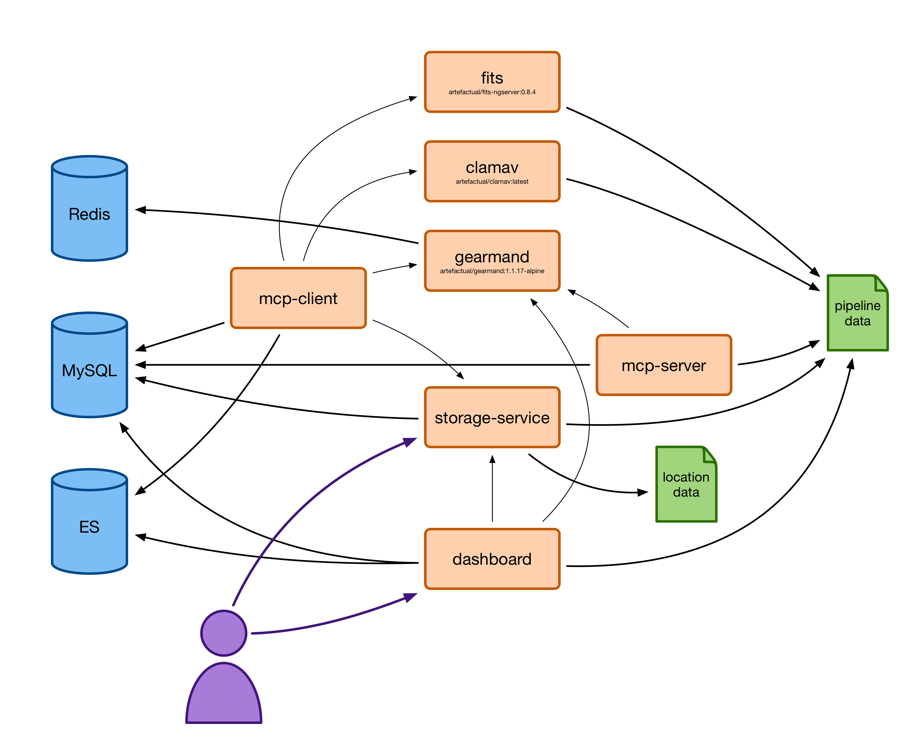

# archivematica-infra

These docs are intended for platform developers who are setting up our Archivematica instance or writing new features for Archivematica.
They are *not* intended for people who are *using* Archivematica.

You might find the Artefactual docs helpful: <https://www.archivematica.org/en/docs/archivematica-1.8/>

## Architecture of services

Last updated: 4 March 2019.

We run Archivematica as a series of containers in ECS.
I started from the [docker-compose.yml][compose], which gave me an idea of what containers, volumes, and data stores I need to run:

In the docker-compose definition:

*   The orange boxes are containers
*   The green documents are shared volumes
*   The blue databases are shared data stores (running in other containers)

An arrow indicates that X depends on Y in the docker-compose definition.

For deploying on ECS:

*   We're deploying each container in its own task, and using ECS service discovery to expose them all to each other
*   We're using EFS mounted on EC2 hosts for the shared volumes
*   We're using Amazon Elasticache, Amazon RDS, and Elastic Cloud for the shared data stores

The Docker images for the core Archivematica services (mcp-client, mcp-server, storage-service and dashboard) are built and automatically published from the `wellcome-storage-service` branch in our forks of the Archivematica repos.

[compose]: https://github.com/artefactual-labs/am/blob/9567e9578a85fd10657cb815fb2714dbb5caa333/compose/docker-compose.yml

## Deploying new services

If you want to deploy a new version of a service:

*   Push a new version of your code to the `wellcome-storage-service` branch in the appropriate repo

*   Wait for Travis to build your branch (which publishes a new image to ECR)

    -   MCP client/server, dashboard: <https://travis-ci.org/wellcometrust/archivematica/branches>
    -   Storage service: <https://travis-ci.org/wellcometrust/archivematica-storage-service/branches>

*   Inside this repo, run `make tf-plan` and then `make tf-apply`.

## Known issues

*   When you do a fresh deployment, we don't bootstrap the database tables or run database migrations -- right now you have to SSH into the EC2 instance, exec into the container, and run the migration/table creation manually.
    We should do that automatically.

    Tracked by <https://github.com/wellcometrust/platform/issues/3471>
